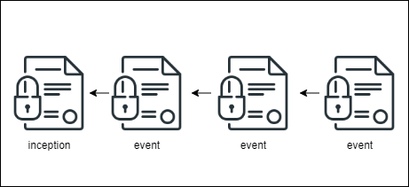
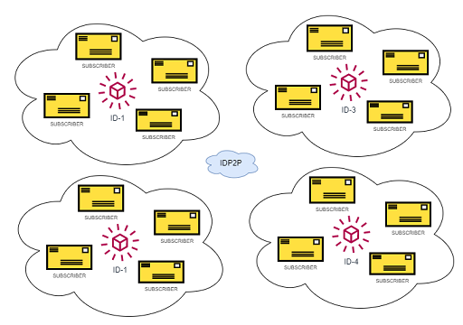

# IDP2P

> `Experimental`, inspired by `ipfs`, `did:peer` and `keri`

## Background

See also (related topics):

* [Decentralized Identifiers (DIDs)](https://w3c.github.io/did-core)
* [Verifiable Credentials](https://www.w3.org/TR/vc-data-model/)
* [IPFS](https://ipfs.io/)
* [LIBP2P](https://libp2p.io/)
* [Key DID](https://github.com/w3c-ccg/did-method-key/)
* [Peer DID](https://identity.foundation/peer-did-method-spec/)
* [Key Event Receipt Infrastructure](https://keri.one//)

## Problem

Each did method uses own way to implement decentralized identity. Most of them are based on public source of truth like a `blockchain`, `dlt`, `database` or similar. Others are simple, self-describing methods and aren't depend on any ledger technology e.g. `did:peer`, `did:key`, `keri`. Each method has own pros-cons in terms of [design-goals](https://www.w3.org/TR/did-core/#design-goals)

## IDP2P Solution 

`IDP2P` is a peer-to-peer identity protocol which enables a controller to create, manage and share its own proofs as well as did documents. The protocol is based on [libp2p](https://libp2p.io/), in other words, it can be considered `ipfs` of decentralized identity. `IDP2P` has following features:

- Self-describing identity(like `did:keri`, `did:peer`, `did:key`)
- Based on `libp2p` pub-sub protocol, so it can be stored and resolved via network
- P2P network provides one ledger per identity
- ID is also a topic to subsribe(it means ledger is based on subscription)
- Only identity owner and verifiers are responsible for storing and verifying identity


### Identity

#### *example*

```json
{
    "id": "did:p2p:bagaaieratxin4o3iclo7ua3s3bbueds2uzfc5gi26mermevzb2etqliwjbla",
    "microledger": {
      "id": "bagaaieratxin4o3iclo7ua3s3bbueds2uzfc5gi26mermevzb2etqliwjbla",
      "inception": {
        "signer_key": {
          "type": "Ed25519VerificationKey2020",
          "public": "by5gtwpufy4.."
        },
        "recovery_key": {
          "type": "Ed25519VerificationKey2020",
          "digest": "bmb2cvioxfy65ej.."
        }
      },
      "events": [
        {
          "payload": {
            "previous": "bagaaieratxin4o3iclo7u..",
            "signer_publickey": "by5gtwpufy4zfnog4j..",
            "change": {
              "type": "set_document",
              "value": "bdu3gqtjc6ks52.."
            }
          },
          "proof": "bx6svqb6if5yaflgoumdff7j.."
        },
        {
          "payload": {
            "previous": "bagaaieraof7..",
            "signer_publickey": "b2wvipekepehi..",
            "change": {
              "type": "set_proof",
              "key": "bnnsxs",
              "value": "bozqwy5lf"
            }
          },
          "proof": "bwltjvobkxxq6.."
        },
        {
          "payload": {
            "previous": "bagaaiera5jmj..",
            "signer_publickey": "be7tovk6p..",
            "change": {
              "type": "recover",
              "next_signer_key": {
                "type": "Ed25519VerificationKey2020",
                "public": "b443ew4cp.."
              },
              "next_recovery_key": {
                "type": "Ed25519VerificationKey2020",
                "digest": "bcut3s.."
              }
            }
          },
          "proof": "b3yo6vlymyn.."
        }
      ]
    },
    "did_doc": {
      "id": "did:p2p:bagaaieratxin..",
      "controller": "did:p2p:bagaaieratxi..",
      "@context": [
        "https://www.w3.org/ns/did/v1",
        "https://w3id.org/security/suites/ed25519-2020/v1",
        "https://w3id.org/security/suites/x25519-2020/v1"
      ],
      "verificationMethod": [],
      "assertionMethod": ["did:p2p:bagaaieratxib#wtyb2xhyvxolbd.."],
      "authentication": ["did:p2p:bagaaieratxib#3txadadmtke6d.."],
      "keyAgreement": ["did:p2p:bagaaieratxib#cnzphk5djc3bt64.."]
    }
  }
```

An `idp2p` identity includes unique identifier, microledger and did document. 

```json
{
    "id": "did:p2p:z6MkpTHR8VNsBxYAAWHut2Geadd9jSwuBV8xRoAnwWsdvktH",
    "microledger": {},
    "did_doc": {}
}
```

*`id`* is the unique identifier of identity. It uses id generation like `did:peer`. ID should be generated following way: 

- Generate an inception block
- Get json string of the block
- Convert it to bytes
- Get SHA-256 digest of bytes
- Encode it with multibase and multicodec(like `ipfs`)

*sample id*: `did:p2p:bagaaieratxin4o3iclo7ua3s3bbueds2uzfc5gi26mermevzb2etqliwjbla`

`microledger` represents backing storage of identity and it includes id, inception and events for identity

```json
  {
    "id": "bagaaieratxin4o3iclo7ua3s3bbueds2uzfc5gi26mermevzb2etqliwjbla",
    "inception": {},
    "events": []
  }
```

`did_doc` is described in [DIDs Spec](https://www.w3.org/TR/did-core/). Only latest document is stored in identity.

```json
{
    "id": "did:p2p:bagaaieratxin..",
    "controller": "did:p2p:bagaaieratxi..",
    "@context": [
        "https://www.w3.org/ns/did/v1",
        "https://w3id.org/security/suites/ed25519-2020/v1",
        "https://w3id.org/security/suites/x25519-2020/v1"
    ],
    "verificationMethod": [...],
    "assertionMethod": ["did:p2p:bagaaieratxib#wtyb2xhyvxolbd.."],
    "authentication": ["did:p2p:bagaaieratxib#3txadadmtke6d.."],
    "keyAgreement": ["did:p2p:bagaaieratxib#cnzphk5djc3bt64.."]
}
```

### Microledger Details

`id` is same with identifier except `did:p2p:` prefix.

`inception` includes `signer` public key and `recovery` public key digest

```json
{
  "signer_key": {
    "type": "Ed25519VerificationKey2020",
    "public": "by5gtwpufy4.."
  },
  "recovery_key": {
    "type": "Ed25519VerificationKey2020",
    "digest": "bmb2cvioxfy65ej.."
  }
}
```

`events` is array of identity changes and each event is linked to the previous one. First event is linked inception block.

 


```json
{
    "payload": {
      "previous": "<inception-hash>",
      "signer_publickey": "by5gtwpufy4zfnog4j..",
      "change": {
        "type": "set_document"
      }
    },
    "proof": "bx6svqb6if5yaflgoumdff7j.."
}
```

There are three event types.

- `set_document`: proof of did document change, requires `value` property which is hash of did document.
- `set_proof`: any proof about identity,  requires `key` and `value` properties.
- `recover` recovery proof of identity requires `next_signer_key` and `next_recovery_key` properties.

### Consensus Mechanism 

When an identity event has occured, change is published over `idp2p` network, all subscribers verifies new did change and updates its own ledger if incoming change is suitable.

There are two pub-sub commands: 

- `get`: when a peer want to subscribe to identity, it publishs a `get` command with `id` over the network. 
- `post`: when a peer received a `get` command or an identity change occured, it posts identity information to subscribers in order to reach a consensus

 


## Getting Started(rust demo) 

#### Generate a peer

- ```cargo run```

#### Create identity

- cmd: ```create-id <name>```

- ex: `create-id ademcaglin`

#### Subscribe to identity

- cmd: ```get <id>```
- ex: `get did:p2p:bagaaieraam4...`

#### Resolve identity

- cmd: ```resolve <id>```
- ex: `resolve did:p2p:bagaaieraam4...`

#### Create new doc

- cmd: ```create-doc <name>```
- ex: `create-doc ademcaglin`

#### Recover

- cmd: ```recover <name>```
- ex: `recover ademcaglin`

#### Demo 


## Contributions

The idp2p protocol and  `rust` implementation in is a work in progress. 

Contributions are most welcome

## License

[Apache License 2.0](LICENSE) 

