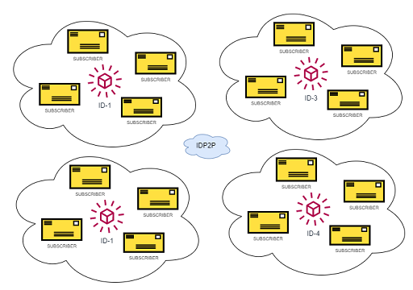

# IDP2P(experimental)

> Everything about you, nothing about you(only proofs)

## Background

See also (related topics):

* [Decentralized Identifiers (DIDs)](https://w3c.github.io/did-core)
* [Verifiable Credentials](https://www.w3.org/TR/vc-data-model/)
* [IPFS](https://ipfs.io/)
* [LIBP2P](https://libp2p.io/)
* [Key DID](https://github.com/w3c-ccg/did-method-key/)
* [Peer DID](https://identity.foundation/peer-did-method-spec/)
* [Key Event Receipt Infrastructure](https://keri.one//)

## Problem

Each did method tries to solve decentralized identity problems with different ways. Most of them are based on public source of truth like a `blockchain`, `dlt`, `database` or similar. Others are simple, self-describing methods and aren't depend on any ledger technology e.g. `did:peer`, `did:key`, `did:keri`. Each method has own pros-cons in terms of following features: 

- Decentralization
- Easy to use
- Resolve
- Cost and Efficiency

## IDP2P Solution 

`IDP2P` is a peer-to-peer identity protocol and network which enables a controller to store its own proofs. It stores did documents and proofs about an identity. The `idp2p` protocol is based on `libp2p`, in other words, it can be considered ipfs of decentralized identity. `IDP2P` has following features:

- Self describing identity(like did:keri, did:peer, did:key)
- Only identity owner and verifiers are responsible for storing identity materials
- Based on subscription based ledger and consensus, it is 
- Resolvable via `idp2p` network 

### Consensus `TODO`

 

### Identity Generation

A p2p identity includes id, microledger and did document. Id is the unique identifier of identity. 

```json
{
    "id": "did:p2p:z6MkpTHR8VNsBxYAAWHut2Geadd9jSwuBV8xRoAnwWsdvktH",
    "microledger": {},
    "did_doc": {}
  }
```

Microledger includes id, inception and events for identity

```json
  {
    "id": "z6MkpTHR8VNsBxYAAWHut2Geadd9jSwuBV8xRoAnwWsdvktH",
    "inception": {},
    "events": []
  }
```

Inception includes `signer_key`(public) and `recovery_key`(digest). 

```json
{
  "signer_key": {
    "type": "Ed25519VerificationKey2020",
    "public": "by5gtwpufy4.."
  },
  "recovery_key": {
    "type": "Ed25519VerificationKey2020",
    "digest": "bmb2cvioxfy65ej.."
  }
}
```

First event should to point inception, others should point last event. An event has `payload` and `proof`

```json
{
    "payload": {
      "previous": "<inception-hash>",
      "signer_publickey": "by5gtwpufy4zfnog4j..",
      "change": {
        "type": "set_document"
      }
    },
    "proof": "bx6svqb6if5yaflgoumdff7j.."
}
```

There are three event types.

#### DID Document Proof

`set_document`: proof of did document change, requires `value` property which is hash of did document.

#### Proof

`set_proof`: any proof about identity,  requires `key` and `value` properties.

#### Recovery Proof

`recover` recovery proof of identity requires `next_signer_key` and `next_recovery_key` properties.


#### IDP2P Example

```json
{
    "id": "did:p2p:bagaaieratxin4o3iclo7ua3s3bbueds2uzfc5gi26mermevzb2etqliwjbla",
    "microledger": {
      "id": "bagaaieratxin4o3iclo7ua3s3bbueds2uzfc5gi26mermevzb2etqliwjbla",
      "inception": {
        "signer_key": {
          "type": "Ed25519VerificationKey2020",
          "public": "by5gtwpufy4.."
        },
        "recovery_key": {
          "type": "Ed25519VerificationKey2020",
          "digest": "bmb2cvioxfy65ej.."
        }
      },
      "events": [
        {
          "payload": {
            "previous": "bagaaieratxin4o3iclo7u..",
            "signer_publickey": "by5gtwpufy4zfnog4j..",
            "change": {
              "type": "set_document",
              "value": "bdu3gqtjc6ks52.."
            }
          },
          "proof": "bx6svqb6if5yaflgoumdff7j.."
        },
        {
          "payload": {
            "previous": "bagaaieraof7..",
            "signer_publickey": "b2wvipekepehi..",
            "change": {
              "type": "set_proof",
              "key": "bnnsxs",
              "value": "bozqwy5lf"
            }
          },
          "proof": "bwltjvobkxxq6.."
        },
        {
          "payload": {
            "previous": "bagaaiera5jmj..",
            "signer_publickey": "be7tovk6p..",
            "change": {
              "type": "recover",
              "next_signer_key": {
                "type": "Ed25519VerificationKey2020",
                "public": "b443ew4cp.."
              },
              "next_recovery_key": {
                "type": "Ed25519VerificationKey2020",
                "digest": "bcut3s.."
              }
            }
          },
          "proof": "b3yo6vlymyn.."
        }
      ]
    },
    "did_doc": {
      "id": "did:p2p:bagaaieratxin..",
      "controller": "did:p2p:bagaaieratxi..",
      "@context": [
        "https://www.w3.org/ns/did/v1",
        "https://w3id.org/security/suites/ed25519-2020/v1",
        "https://w3id.org/security/suites/x25519-2020/v1"
      ],
      "verificationMethod": [
        {}
      ],
      "assertionMethod": [
        "did:p2p:bagaaieratxib#wtyb2xhyvxolbd.."
      ],
      "authentication": [
        "did:p2p:bagaaieratxib#3txadadmtke6d.."
      ],
      "keyAgreement": [
        "did:p2p:bagaaieratxib#cnzphk5djc3bt64.."
      ]
    }
  }
```


## Implementation `TODO`

### Install `TODO`

> Requires rust and cargo

### Usage


### Create a peer

- ```cargo run -p <port>```

### Create idenity

- ```create-id <name>```

### Subscribe to identity

- ```get <id>```

### Reslove identity

- ```resolve <id>```

### Create new doc

- ```create-doc <name>```


## License

[Apache](LICENSE) 

